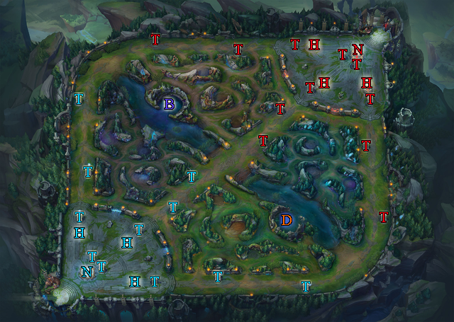

# **League-of-Legends-Death-Point**
## เกี่ยวกับ Project 
### จุดประสงค์ของ Project
 จุดประสงค์ของ Project คือการเอาข้อมูล Match การแข่งขันกีฬา E-sport  ของเกม League-of-Legends ในระดับลีค มาวิเคราะห์หาจุดพิกัดในการฆ่าและความยาวของเกมเฉลี่ยนต่อต่อปี ตั้งแต่ปี 2015 ถึง ต้นปี 2018 โดยแบ่งออกเป็น 7 ลีค ดังนี้
 - Campeonato Brasileiro de League of Legends (CBLoL)
 - EU League Championship Series (EULCS)
 - League of Legends Champions Korea (LCK)
 - League of Legends Master Series (LMS)
 - NA League Championship Series (NALCS)
 - Oceanic Pro League (OPL)
 - Turkish Champions League (TCL)
#### **การแข่งขันชิงแชมป์โลก**
 - World Championship (WC)
### **เกี่ยวกับ League-of-Legends หรือ LoL**
 - League-of-Legends คือ เป็นเกมออนไลน์ที่แข่งขันกันในรูป Moba โดยแบ่งเป็น 2 ฝ่าย ทั้งสองฝ่ายจะต้องใช้แชมเปี้ยน การต่อสู้จะเป็นไปในรูปแบบของประชันหน้ากันของตัวละครหลายๆคนในสนามประลอง ตัวเกมนั้นมีแบ่งระดับความเหมาะสมตามระดับของผู้เล่น โดยภายในตัวเกมประกอบไปด้วย Object ต่างๆ ดังนี้
 #### Map of League-of-Legends

 - **N ย่อมาจาก Nexus** คือ เป้าหมายที่ต้องทำลายของแต่ละฝ่ายหากฝ่ายไหนถูกทำลายก่อนฝ่ายนั้นจะเป็นผู้แพ้เกม
 - **I ย่อมาจาก Inhibitor** คือ สิ่งก่อสร้างที่เมื่อถูกทำลายจะทำให้มินเนี่ยนของฝั่งตรงข้ามแข็งแกร่งขึ้น
 - **T ย่อมาจาก Turret** คือ ป้อมประการที่ต้องทำลายตามลำดับ มีหน้าที่ป้องกันฝั่งตรงข้ามไปโจมตี Nexus 
 - **B ย่อมาจากBaron** คือ สัตว์ในตำนานที่จะเสริมพลังความแข็งแกร่งให้มินเนี่ยนฝั่งที่กำจัดได้
 - **D ย่อมาจาก Dragon** คือ มังกรที่จะเสริมพลังความแข็งแกร่งให้กับตัวละครทั้งทีมของฝั่งที่กำจัดได้
### ผู้จัดทำ Project
 1. นายภาสกร นุชิตขจรวุฒิ 61070164
 2. นาย พีรกานต์ เดชวิไลเรือง 61070147
 3. นาย อนุชา เว่ย 61070257
 4. นางสาวอัญชิษฐา บุญณะสิทธิ์ 61070264
