# **League-of-Legends-Death-Point**
## เกี่ยวกับ Project 
### จุดประสงค์ของ Project
 จุดประสงค์ของ Project คือการเอาข้อมูล Match การแข่งขันกีฬา E-sport  ของเกม League-of-Legends ในระดับลีค มาวิเคราะห์หาจุดพิกัดในการฆ่าและความยาวของเกมเฉลี่ยต่อปี ตั้งแต่ปี 2015 ถึง ต้นปี 2018 โดยแบ่งออกเป็น 7 ลีค ดังนี้
 - Campeonato Brasileiro de League of Legends (CBLoL)
 - EU League Championship Series (EULCS)
 - League of Legends Champions Korea (LCK)
 - League of Legends Master Series (LMS)
 - NA League Championship Series (NALCS)
 - Oceanic Pro League (OPL)
 - Turkish Champions League (TCL)
#### **การแข่งขันชิงแชมป์โลก**
 - World Championship (WC)
### **เกี่ยวกับ League-of-Legends หรือ LoL**
 - League-of-Legends คือ เป็นเกมออนไลน์ที่แข่งขันกันในรูป Moba โดยแบ่งเป็น 2 ฝ่าย ทั้งสองฝ่ายจะต้องใช้แชมเปี้ยน การต่อสู้จะเป็นไปในรูปแบบของประชันหน้ากันของตัวละครหลายๆคนในสนามประลอง ตัวเกมนั้นมีแบ่งระดับความเหมาะสมตามระดับของผู้เล่น โดยภายในตัวเกมประกอบไปด้วย Object ต่างๆ ดังนี้
 #### Map of League-of-Legends

 - **N ย่อมาจาก Nexus** คือ เป้าหมายที่ต้องทำลายของแต่ละฝ่ายหากฝ่ายไหนถูกทำลายก่อนฝ่ายนั้นจะเป็นผู้แพ้เกม
 - **I ย่อมาจาก Inhibitor** คือ สิ่งก่อสร้างที่เมื่อถูกทำลายจะทำให้มินเนี่ยนของฝั่งตรงข้ามแข็งแกร่งขึ้น
 - **T ย่อมาจาก Turret** คือ ป้อมประการที่ต้องทำลายตามลำดับ มีหน้าที่ป้องกันฝั่งตรงข้ามไปโจมตี Nexus 
 - **B ย่อมาจากBaron** คือ สัตว์ในตำนานที่จะเสริมพลังความแข็งแกร่งให้มินเนี่ยนฝั่งที่กำจัดได้
 - **D ย่อมาจาก Dragon** คือ มังกรที่จะเสริมพลังความแข็งแกร่งให้กับตัวละครทั้งทีมของฝั่งที่กำจัดได้
 
 โดยเงื่อนไขในการชนะเกม คือการทำลาย Nexus ฝ่ายตรงข้าม โดยต้องทำลายป้อมตามลำดับในแต่ละเลนเพื่อไปถึง Nexus(ไม่จำเป็นต้องทำลายทุกเลน)
 
 
 ## =====================================================
 
 ### **ผลลัพธ์ที่วิเคราะห์ออกมา**
 #### *ความยาวเกมเฉลี่ย*
 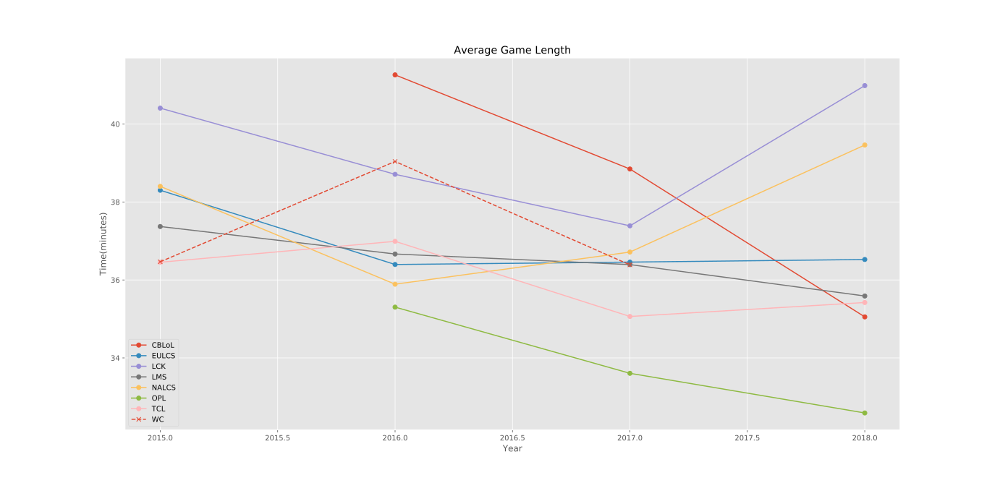
 
 **โดยสรุปจากรูปกราฟที่เเสดงดังกล่าวในข้างต้น ในแต่League ได้ดังนี้ โดย 3 อันดับแรก ที่เล่นเกมยาวนานที่สุด ได้เเก่**  
 - 1. LCK , NALCS และ EULCS ► โดยเราจะเห็นได้ว่า leagueที่เวลาผ่านไป ยิ่งจะมีแนวโน้มที่จะเล่นนานขึ้นเรื่อยๆ ซึ่งต่างกับleague EULCS มีแนวโน้มใน เวลาเล่นที่คงที่ ตั้งแต่        ปี2015 ถึงปัจจุบัน 
 - 2. CBLOL , OPL และ TCL ► โดยเราจะเห็นได้ว่า แตกต่างจาก league ข้างต้นที่ได้กล่าวไว้ ซึ่งสามleagueนี้ จะเน้นการจบไว โดยที่จะเห็นได้ชัดคือ สองleague แรก
 (CBLOL , OPL **หมายเหตุ** โดยสองleague ที่กล่าวนี้ ก่อนปี2015 ไม่มีในdatabase โดยได้เริ่มวิเคราะห์ตั้งแต่ปี2015เป็นต้น) 

  #### *CBLoL*
  ในปี 2016 สังเกตได้ว่าเกิดการฆ่ากันที่กลางแม่น้ำจำนวนมากในช่วงหลังจาก 20 นาที ในขณะที่ปี 2017 จะเน้นไปที่จุดเกิดบารอนมากกว่าและปี 2018 ยังไม่มีข้อมูลมากนักเพราะเป็นการแข่งขันในช่วงต้นปี
  
 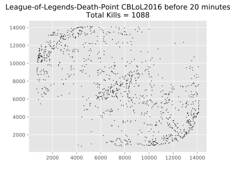 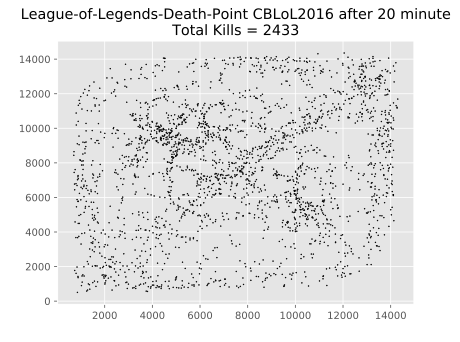
 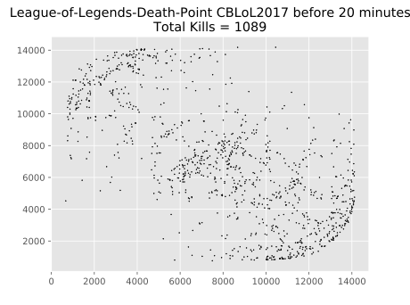 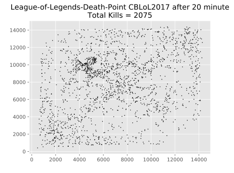
 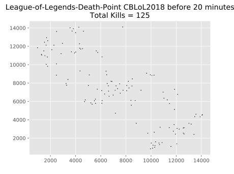 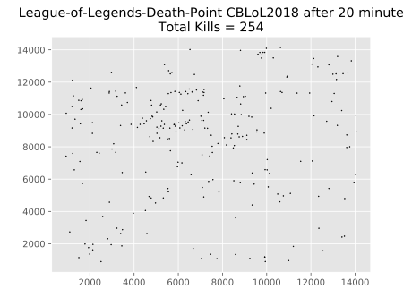
  #### *EULCS*
  ในช่วงต้นเกมทั้ง 3 ปี 2015 2016 และ 2017 เห็นได้ชัดว่าแต่ละเลนมีการฆ่ากันจำนวนมากในอาณาเขตของป้อมปราการแรกและต่อมาก็เน้นไปที่บารอนและกลางแม่น้ำ ปี 2018 เน้นรวมทีมกันที่เลนกลาง
  
 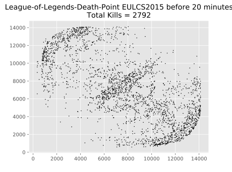 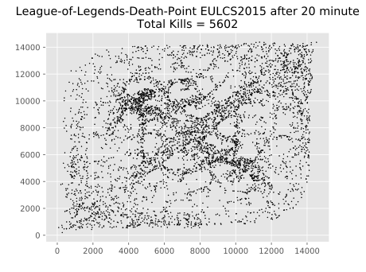
 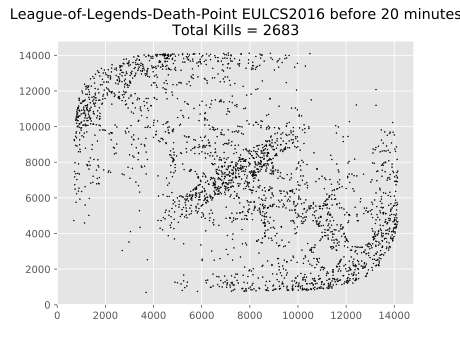 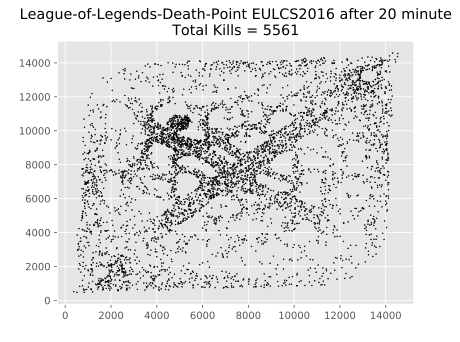
 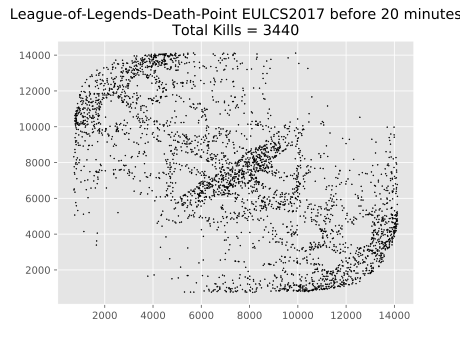 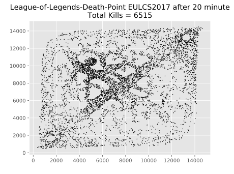
 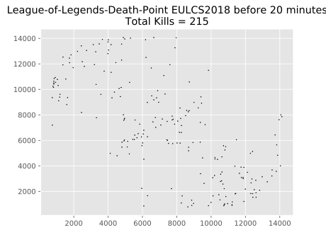 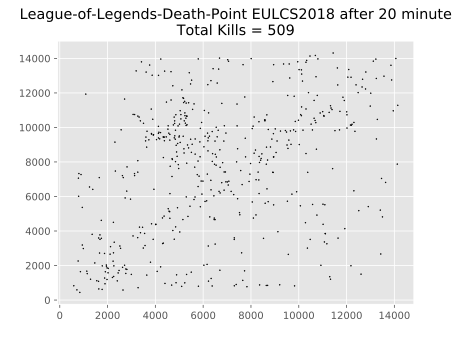
  #### *LCK*
  ช่วงต้นเกมของปี 2015 เน้นเก็บมังกรที่ฝั่งแม่น้ำล่างตลอดจนถึงช่วงท้ายเกมเช่นเดียวกับปี 2016 ส่วนปี 2017 การฆ่ากันหน้า Nexus มีจำนวนที่มากกว่าปีก่อนๆ ส่วนปี 2018 ช่วงต้นเกมมีการฆ่ากันที่เล่นบนและล่างมากกว่าเลนกลาง
  
 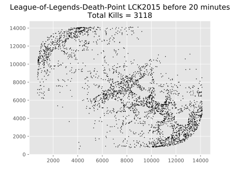 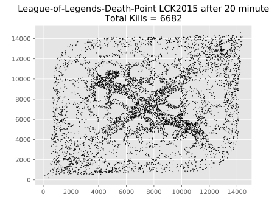
 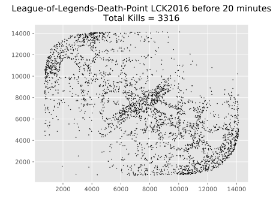 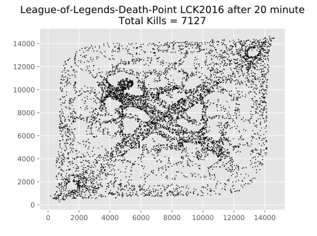
 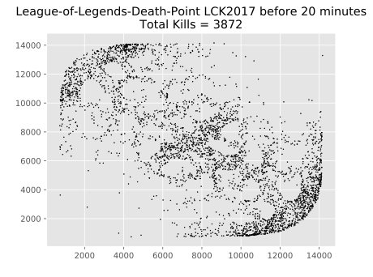 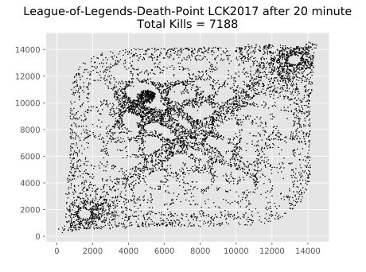
 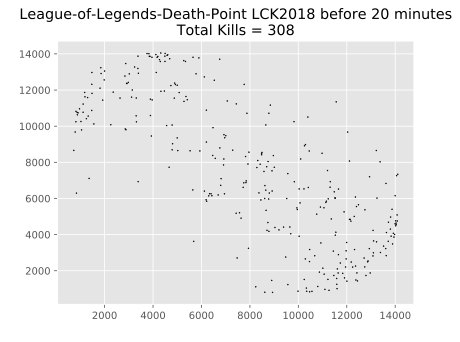 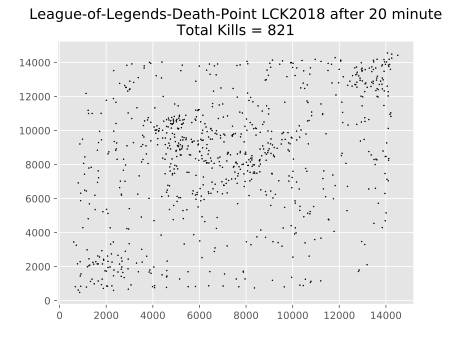
  #### *LMS*
  ปี 2015 ไปเน้นเอาบารอนเหมือนปี 2016 แต่มีการฆ่ากันของแต่ละเลนมากกว่า ส่วนในปี 2016 สังเกตได้ว่ามีจุดฆ่ากันมากในอาณาเขตป้อมปราการแรกของฝั่งทีมสีฟ้า แสดงว่าเลนล่างทีมสีฟ้าแพ้เลนให้กับทีมสีแดง ปี 2017 มีการฆ่ากันในแต่ละเลนและท้ายเกมรวมทีมกันเอาบารอน ปี 2018 มีการฆ่ากันที่ป่าฝั่งทีมสีแดงมากกว่าทีมสีฟ้า
  
 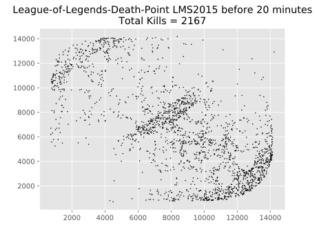 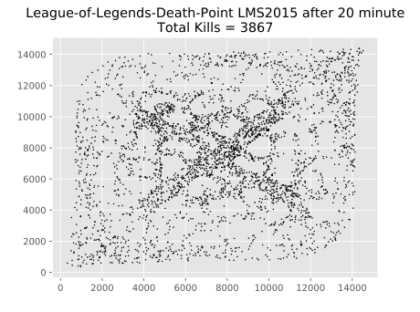
 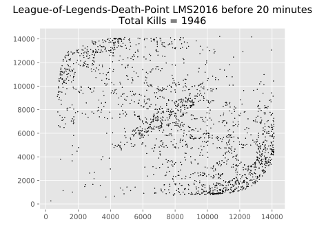 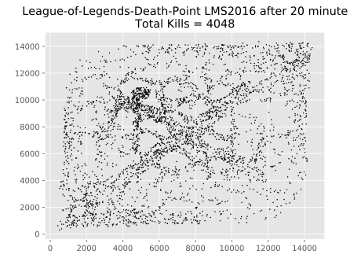
 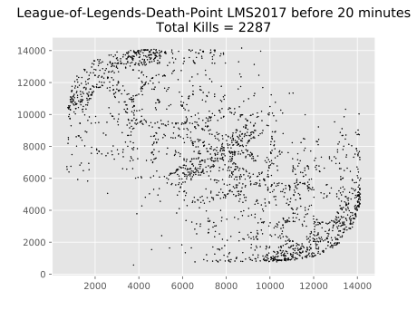 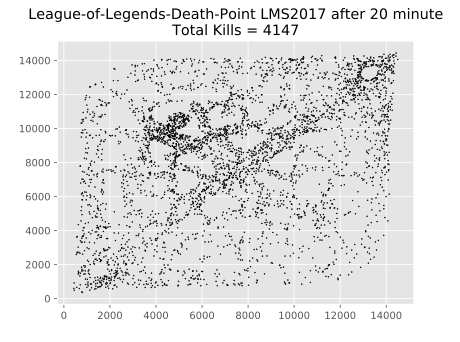
 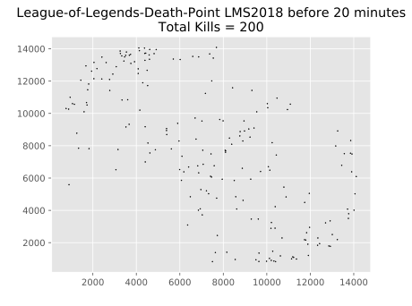 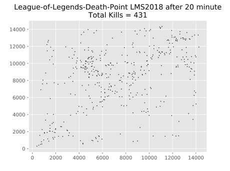
  #### *NALCS*
  ปี 2015 และ 2016 มีการฆ่ากันในแต่ละเลนและท้ายเกมมีการฆ่ากันจำนวนมากที่เลนกลางและกลางแม่น้ำ ส่วนปี 2017 มีจำนวนการฆ่ากันเพิ่มขึ้นอย่างมากแต่ก็ยังคงรูปแบบเดิมและปี 2018 ต้นเกมมีการฆ่ากันที่ป่าฝั่งล่างมากกว่าป่าฝั่งบน
  
 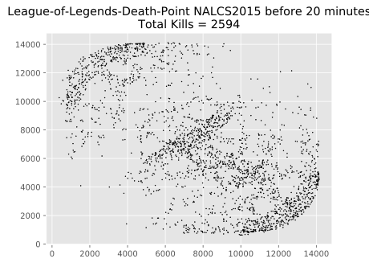 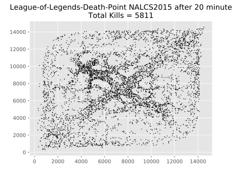
 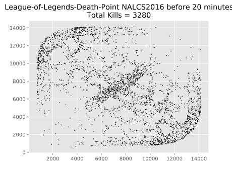 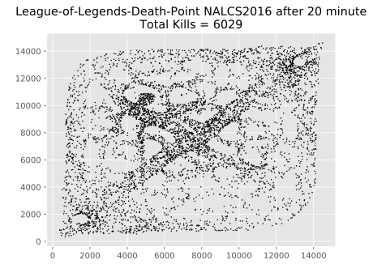
  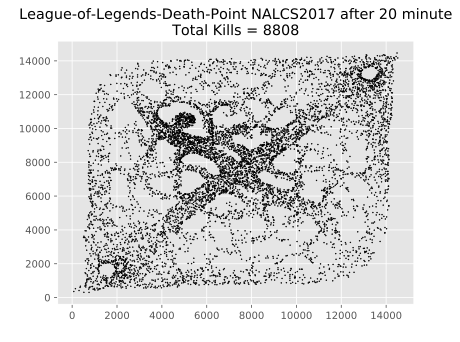
 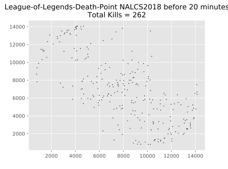 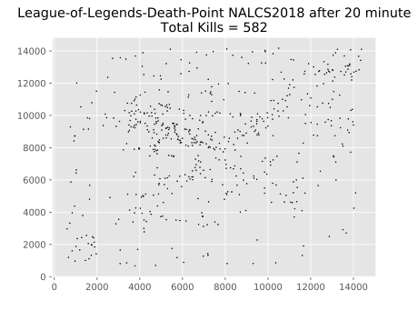
  #### *OPL*
  ปี 2016 และ 2017 ไม่เก็บบารอนมากนัก แต่เน้นไปที่การรวมทีมที่เลนกลางและปี 2018 แทบไม่มีการฆ่าในป่าช่วงต้นเกม
  
 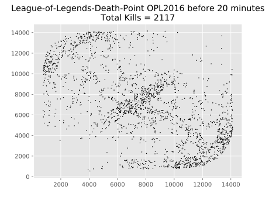 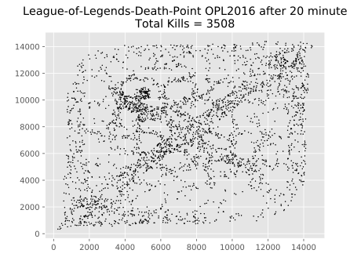
 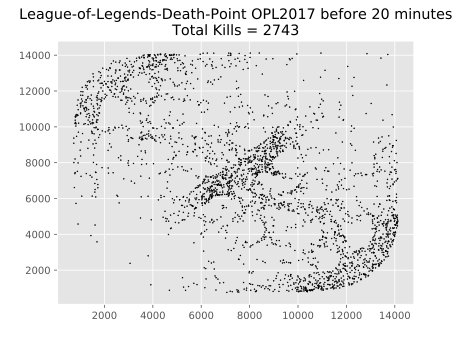 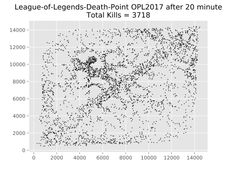
 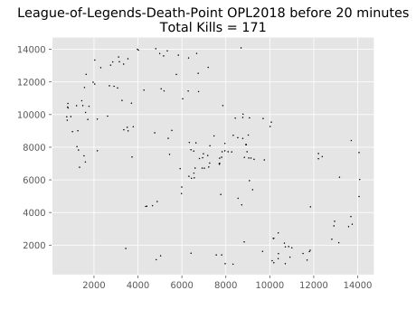 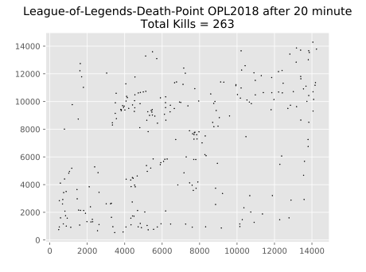
  #### *TCL*
  การฆ่ากันเพิ่มขึ้นเรื่อยในแต่ละปีตั้งแต่ 2015 จนถึง 2017 การให้ความสำคัญกับบารอนก็เพิ่มขึ้นเช่นกันช่วงต้นเกมของปี 2018 แทบไม่มีการฆ่ากันในป่า
  
 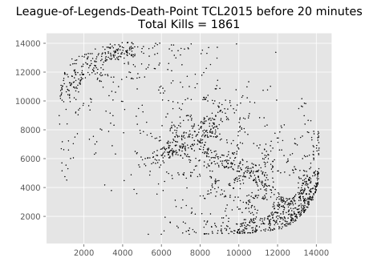 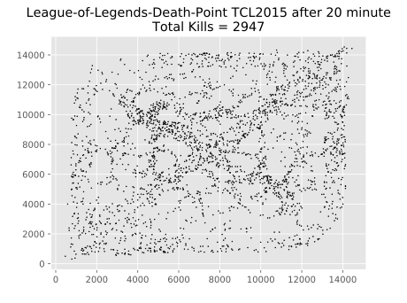
 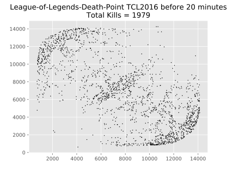 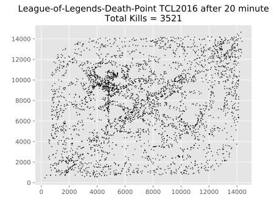
 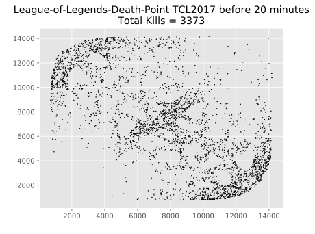 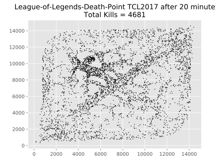
  
 #### **WC**
 การแข่งกันของทั้ง 3 ปี เป็นการเล่นแบบไม่เน้นการฆ่ากันมากนัก โดยรวมสังเกตเห็นว่ามีการฆ่ากันในป่ามากกว่าลีคอื่นๆ แสดงให้เห็นว่ามีการโซนป่าและมีทัศนวิสัยในป่าที่ดีกว่า จำนวนการตายที่ฝั่งทีมแดงหน้า Nexus มีจำนวนมากกว่าทำให้เห็นว่าทีมสีฟ้าได้เปรียบฝั่งทีมสีแดง
 
  
  
  
 
 

### ผู้จัดทำ Project
 1. นายภาสกร นุชิตขจรวุฒิ 61070164
 2. นางสาวอัญชิษฐา บุญณะสิทธิ์ 61070265
 3. นายอนุชา เว่ย 61070257
 4. นายพีรกานต์ เดชวิไลเรือง 61070147
 
 
##### ขอบคุณข้อมูลจาก : https://www.kaggle.com/chuckephron/leagueoflegends#LeagueofLegends.csv
